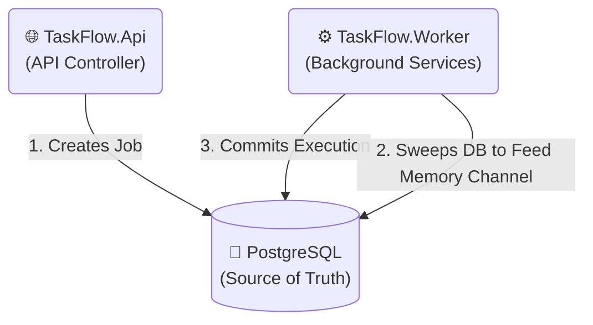

# TaskFlow 🚀

TaskFlow is a production-grade, distributed background job processing system natively designed for .NET. Built strictly utilizing **Clean Architecture** and **Domain-Driven Design (DDD)**, it guarantees absolute worker reliability, optimistic concurrency control, and zero-loss crash recovery workflows without requiring external brokers out-of-the-box.

---

## 🏗️ Clean Architecture & Flow

The system consists of three main components communicating synchronously with absolute data sovereignty.



### Component Interaction Deep-dive
1. **API**: Receives an HTTP POST and invokes `IJobRepository`. It saves the `Job` Entity into Postgres as the single source of truth (`Status: Pending`).
2. **Worker (JobSweeper)**: A Background loop querying Postgres every 10 seconds. It pulls natively structured `Pending` jobs into a high-speed `InMemory Channel`. 
3. **Worker (JobWorker)**: Sits blocked on the channel. Instantly dequeues memory instances, issues a strict Distributed Lock (`MarkAsProcessing`), and fires exact business logic configurations.

---

## 🚦 Failure Scenarios & Recovery

TaskFlow maps real-world system outages directly into its unanemic Business Domain seamlessly to ensure zero execution leakage. 

| Failure Scenario | Defensive Mechanism | Resolution Outcome |
| :--- | :--- | :--- |
| **Duplicate Delivery Attempt** | Idempotency Check | Job is skipped harmlessly by the Application Guard. |
| **Two workers fetching identical Jobs** | Optimistic Concurrency | `DbUpdateConcurrencyException` aborts the trailing worker instantly. |
| **Hardware / OOM Crash mid-execution** | JobSweeper Timeout Rule | Sweeper identifies `LockExpiresAt < now`, flags failure gracefully, and requeues natively to `Pending`. |
| **3rd Party API Outage (e.g. Email Down)**| Handler Exception Trap | Catches the thrown error securely, recalculates Exponential Backoff natively, and logs `Failed`. |

---

## 🧐 Trade-Offs & Decisions

* **Why No Redis or RabbitMQ?** 
  To demonstrate extreme infrastructure parsimony, this project orchestrates the robust `.NET System.Threading.Channels` as an incredibly low-latency internal loop, utilizing the relational database as its durability anchor. Adding Redis simply for basic queueing when EF Core RowVersions provide bullet-proof atomic locks introduces unnecessary operational bloat for MVP footprints.
* **Why Database Polling (Sweeper)?**
  If two detached Docker containers must synchronize state without a TCP-based Message Broker, polling the physical database is mathematically necessary. We mitigate "Tight Loops" and CPU hammering by bounding the sweeps exactly 10s apart, ensuring instant local Channel pickup the moment the data arrives while retaining pristine network health metrics.

---

## 🐳 Getting Started (Zero-Friction Docker)

Run the entire suite locally within seconds using Docker. This boots the API, identical Worker process, and a mapped Postgres instance.

> [!NOTE] 
> Automatic migrations (`Database.Migrate()`) will trigger safely on startup syncing the EF Core models precisely to the raw database. Ensure you run `dotnet ef migrations add` natively if scaling custom domain columns.

```bash
docker-compose up --build
```

### ⚡ Quick Test (30 seconds)

**1. Create a Distributed Job**
```bash
curl -X POST http://localhost:5000/jobs \
     -H "Content-Type: application/json" \
     -d '{"type": "SendEmail", "payloadType": "TaskFlow.Integrations.SendEmailPayload", "payload": "{\"To\": \"user@example.com\"}"}'
```
*You will immediately see the Worker log acknowledging the sweep and mapping execution traces!*

**2. Query Native Status**
Replace the wildcard UUID with your specific ID generated above:
```bash
curl http://localhost:5000/jobs/e3b0c442-989b-464c-869f-0123456789ab
```

**3. Health Check**
```bash
curl http://localhost:5000/health
```
