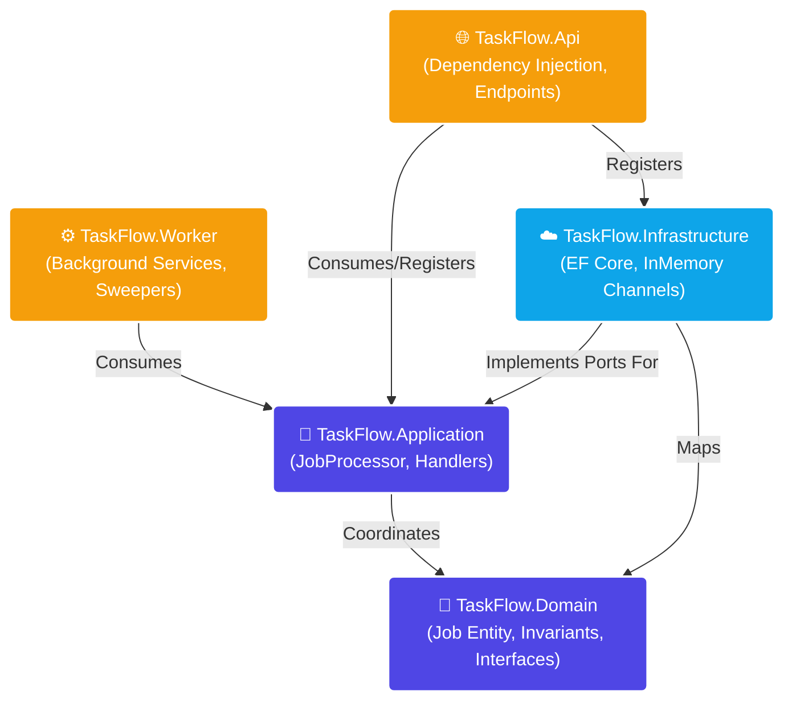
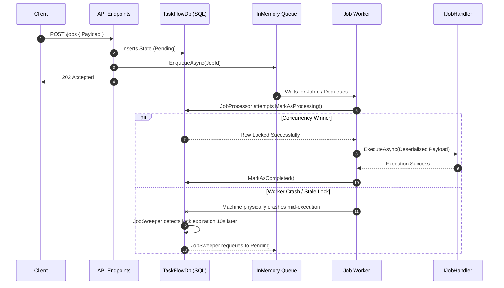

# TaskFlow 🚀

TaskFlow is a production-grade, distributed background job processing system built on .NET. Designed with **Clean Architecture** and **Domain-Driven Design (DDD)**, it provides extreme reliability, optimistic concurrency control, and robust crash recovery methods.

## ✨ Core Features

* **Resilient Distribution**: Built to scale. Workers acquire pessimistic/optimistic locks via EF Core row versioning, ensuring two workers never process the same job instance twice.
* **Smart Retry & Exponential Backoff**: Transient failures are automatically requeued safely with exponential backoff delays ($2^{retry \ count}$ seconds).
* **Dead-Letter Queues**: Exhausted jobs are gracefully parked in a `DeadLettered` state requiring manual intervention to prevent infinite failure loops.
* **Automated Sweeper & Crash Recovery**: If a host machine suddenly dies (OOM, Hardware Failure) while holding a job lock, a self-healing `JobSweeper` gracefully identifies the stale lease, handles the required domain transitions, and puts the job back in the execution queue.
* **Ultra-low latency MVP**: Deploys utilizing `System.Threading.Channels` as an in-memory queue, delivering jobs precisely with microseconds of latency without requiring external infrastructure brokers (like RabbitMQ) out-of-the-box.
* **Delayed / Scheduled Execution**: Full support for natively scheduling jobs in the future.

---

## 🏗️ Architecture & Project Map

TaskFlow relies on strict Clean Architecture dependency boundaries. The innermost layers define the rules, and the outermost layers wire up the physical implementation.



### Layer Breakdown
* **`TaskFlow.Domain`**: Enforces an invariant-rich `Job` aggregate that tightly controls state transitions without external pollution. Zero dependencies.
* **`TaskFlow.Application`**: Contains the core orchestrator (`JobProcessor`). Retrieves jobs, validates idempotency, and delegates to your custom `IJobHandler` configurations.
* **`TaskFlow.Infrastructure`**: Contains the physical Adapters. Houses our SQL Server `DbContext` and the `InMemoryJobQueue` channel logic. 
* **`TaskFlow.Worker`**: The Background Services tracking machine lifetimes, isolating DB transactions under `IServiceScopes`, and capturing all execution anomalies to prevent service crashes natively.

---

## 🔄 The Lifecycle of a Job

How data logically flows from standard creation down to successful execution:



### States
1. **Pending**: Triggered into existence via Database insert.
2. **Scheduled**: Paused waiting for `ScheduledFor` to intersect with UTC Now. Picked up seamlessly by the `JobSweeper`.
3. **Processing**: System safely locks the row by generating a transient `workerId`. 
4. **Completed**: Business logic passed cleanly!
5. **Failed**: Handler threw an Exception. The worker catches it, logs it, recalculates exponentially, and re-publishes.
6. **DeadLettered**: Reached exact `MaxRetry` threshold.

---

## 🔌 API Endpoints

### `GET /health`
Returns system status.

### `POST /jobs`
Submits a new job.
**Request Body**:
```json
{
  "type": "SendEmail",
  "payloadType": "TaskFlow.Integrations.Email.SendEmailPayload",
  "payload": "{\"To\": \"user@example.com\", \"Body\": \"Hello World!\"}"
}
```

### `GET /jobs/{id}`
Returns the specific Domain metrics for a designated job.
**Response**:
```json
{
  "id": "e3b0c442-989b-464c-869f-...",
  "stateName": "Processing"
}
```

---

## 🚀 Getting Started

1. Clone the repository.
2. Ensure you have the latest .NET SDK installed.
3. Hook up your SQL connection string to `DependencyInjection.cs`:
```csharp
services.AddTaskFlowSystem("Server=.;Database=TaskFlowDB;Trusted_Connection=True;");
```
4. Run `dotnet restore` and build! Ensure `TaskFlow.Api` is instantiated properly alongside the integrated Background Services.
